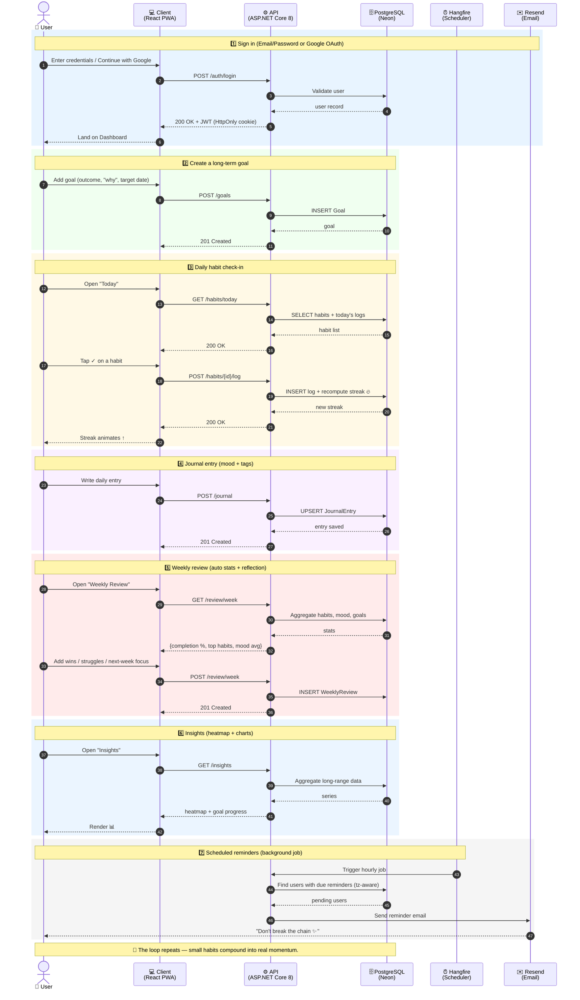

# Momentum — End-to-End Sequence Diagram

One diagram, the whole loop:
**Sign in → Set goals → Daily habits → Journal → Weekly review → Insights → Reminders.**

## Legend

| Actor | Role |
|---|---|
| 👤 **User** | Interacts with the app on web / installed PWA |
| 💻 **Client** | React 19 + Vite PWA (TanStack Query, Zustand, Framer Motion) |
| ⚙️ **API** | ASP.NET Core 8 Web API (Identity + JWT, EF Core, FluentValidation) |
| 🗄️ **PostgreSQL** | Neon-hosted database — goals, habits, logs, journal, reviews |
| ⏰ **Hangfire** | Background scheduler for reminders & recurring jobs |
| ✉️ **Resend** | Transactional email (verification, reset, reminders) |